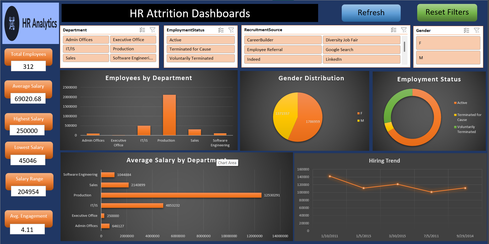

"# HR_Analytics_Dashboars_in_Excel" 
# 🧑‍💼 HR Analytics Dashboard in Excel

## 📊 Overview
The **HR Analytics Dashboard** provides a comprehensive view of key employee metrics to help HR teams make data-driven decisions.  
It highlights **employee distribution, salary analysis, hiring trends, and attrition insights** — all designed using **Microsoft Excel dashboards**.

---

## 🚀 Features
✅ Interactive Slicers for:
- Department  
- Employment Status  
- Recruitment Source  
- Gender  

✅ Visual Components:
- **Employees by Department** (Bar Chart)  
- **Gender Distribution** (Pie Chart)  
- **Employment Status** (Donut Chart)  
- **Average Salary by Department** (Bar Chart)  
- **Hiring Trend** (Line Chart)

✅ KPIs:
- 👥 Total Employees — `312`  
- 💰 Average Salary — `69,020.68`  
- 🏆 Highest Salary — `250,000`  
- 💵 Lowest Salary — `45,046`  
- 💼 Salary Range — `204,954`  
- 📈 Avg. Engagement — `4.11`

---

## 🧠 Insights
- **Production Department** has the highest number of employees and salary expenditure.  
- **Male employees** slightly dominate overall gender distribution.  
- **Voluntary termination** forms a key part of employee attrition trends.  
- **Average engagement** levels remain above `4.0`, indicating stable workforce satisfaction.

---

## 🛠️ Tools Used
- **Microsoft Excel**
  - Power Query for data transformation  
  - Pivot Tables and Charts  
  - Slicers and Buttons for interactivity  
  - Conditional formatting for KPI cards  
- **Design Tools:** Excel shapes, icons, and themes for UI aesthetics.

